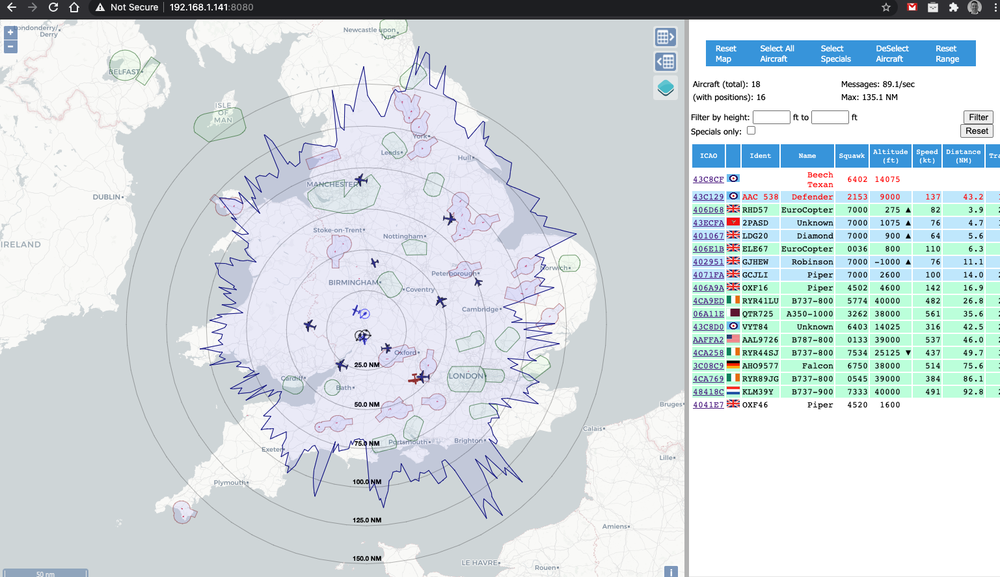
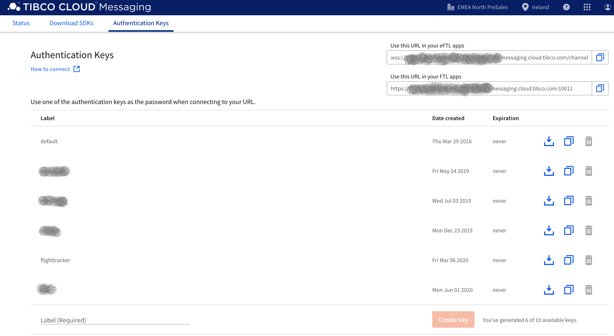
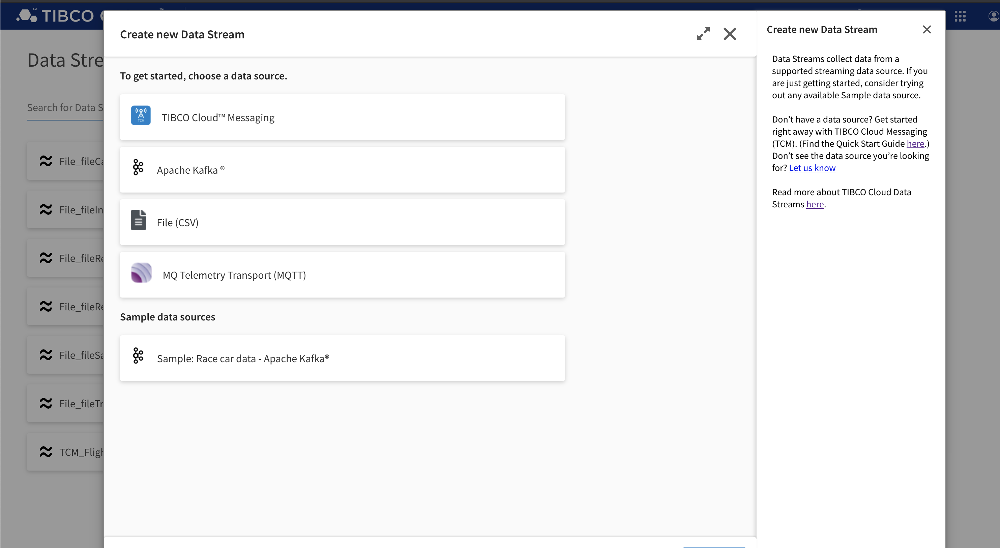

# dump1090toTIBCOeFTL

This Golang application takes ADS-B data received using the dump1090-fa application (https://github.com/adsbxchange/dump1090-fa) gets the data from the dump1090 website and then sends the data to TIBCO Cloud™ Messaging. TIBCO Cloud™ Messaging provides secure and reliable bi-directional data exchange among WebSocket-supported mobile and web apps, IoT devices, and backend systems.

From there - you can utilise the data in any way you like such as through TIBCO Cloud Data Streams (https://www.tibco.com/products/tibco-spotfire/real-time-analytics)

If you're not a TIBCO Cloud Messaging or Cloud Data Streams subscriber - you can get a 30 day trial at https://cloud.tibco.com

TIBCO Cloud Messaging uses the TIBCO eFTL libraries, and we're using the Golang libraries.

## Hardware
To get started - you'll need the appropriate ADS-B receiver kit, antenna and dump1090 running. I chose to get my receiver kit set up on a Raspberry Pi - and in general, I followed the instructions available from FlightAware: (https://uk.flightaware.com/adsb/piaware/build)

Once you have your hardware up and running, and you can see flights being tracked on the local web user interface, then you know that dump1090-fa is running too.



## Antenna

You **REALLY** want to look at your Antenna setup. The stock antenna's generally aren't "tuned" correctly for the frequency that the ADS-B signals are sent by. It's incredibly easy to make your own though. There are a lot of resources that discuss how to make antennas. Here's a really good discussion forum: (https://discussions.flightaware.com/t/three-easy-diy-antennas-for-beginners/16348/55)

I made both the "Spider" Antenna and a Slim Jim Antenna - in testing both were far more sensitive than the stock antenna, and I eventually opted for a Slim Jim antenna - as I could mount it outside and I've managed to get it as high as possible up the side of the house, and the cables/antenna are hidden from general view.

The higher you can get your antenna, the better! To make a Slim Jim Antenna - again there are lots of resources such as: (https://jeroen.steeman.org/Antenna/Slim-Jim-Antenna-Calculator).

In calculators - you need to use 1090mhz as the frequency. I can get pretty decent range. The graph below is a customised version of the dump1090-fa application (as described in the flightaware blog), that shows the maximum range that I have received ADS-B signals. I live ~10 miles away from a local airport, so I get lots of private plane transmissions, helicopters etc.

I can also receive transmissions from aircraft at 40,000 feet from upto 150 miles away fairly regularly. I also live relatively close (~30 miles) to a couple of RAF bases and the main flight path for a number of RAF and USAF planes is right above my house, which I never realised until I set this up! Every now and then, I have seen aircraft from 250 miles - but that's rare.

## Building and Running
Make sure you have Go installed and running (https://golang.org/doc/install)

Next, you will need to install the TIBCO eFTL Go libraries (https://eu.messaging.cloud.tibco.com/docs/getstarted/quickstart-eftl/go-eftl.html). Make sure you have set up the GOPATH accordingly.

You will also need to create an Authentication Key within TIBCO Cloud Messaging, and make a note of it for use later:




Now you are ready to clone this repository and you can build the application using the following command on your target environment:
```
go build .
```
Once built, you can execute the appliction using a command line such as:
```
./dump1090toTIBCOeFTL -dump1090URL http://[dump1090Host]:[dump1090WebPort] -eFTLURL wss://hostname/channel -eFTLKey 243243434244 -region UK -sourceID JohnSmith
```

--dump1090URL needs to point to the machine where dump1090-fa is running. The port is the port of the web server (usually 8080).

--eFTLURL should point to your TIBCO Cloud Messaging endpoint.

--eFTLKey is the authentication key that you create for your endpoint from TIBCO Cloud Messaging.

--region and --sourceID are used as text fields that you could use to filter/sort data

## Viewing results

Once the application is up and running and publishing to TIBCO Cloud Messaging you'll want to visualise the data, and the easiest way to do this is by using TIBCO Cloud Data Streams. 

Once you are logged into TIBCO Cloud Data Streams (https://cloud.tibco.com), you can easily create a new data source - for this application we can choose TIBCO Cloud Messaging - but you can see that we can also receive data from other data sources such as Apache Kafka and MQTT.



The wizard is really straightforward, and if you use the "Assist Me" wizard it will look at the messages being sent to TIBCO Cloud Messaging and automatically detects the schema. Once you've configured the data stream and start the stream, it's available to TIBCO Spotfire Streaming for you to build any visualisation you like!